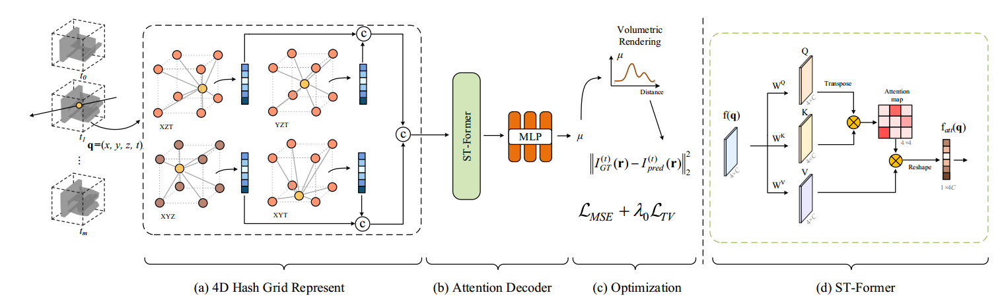

# Spatiotemporal-aware Neural Fields for Dynamic CT Reconstruction


Spatiotemporal-aware Neural Fields for Dynamic CT Reconstruction [[Paper](https://ojs.aaai.org/index.php/AAAI/article/download/33177/35332)] [[Project Page](https://qingyangzhou69.github.io/STNF4D/)].

[Qingyang Zhou](),[Yunfan Ye](https://yunfan1202.github.io),  [Zhiping Cai]().


### Abstract
We propose a dynamic Computed Tomography (CT) reconstruction framework called STNF4D (SpatioTemporal-aware Neural Fields). 
First, we represent the 4D scene using four orthogonal volumes and compress these volumes into more compact hash grids. 
Compared to the plane decomposition method, this method enhances the model's capacity while keeping
the representation compact and efficient. However, in densely predicted high-resolution dynamic CT scenes,
the lack of constraints and hash conflicts in the hash grid features lead to obvious dot-like artifact and
blurring in the reconstructed images. To address these issues, we propose the Spatiotemporal Transformer
(ST-Former) that guides the model in selecting and optimizing features by sensing the spatiotemporal information
in different hash grids, significantly improving the quality of reconstructed images. We conducted experiments on
medical and industrial datasets covering various motion types, sampling modes, and reconstruction resolutions.
Experimental results show that our method outperforms the second-best by 5.99 dB and 4.27 dB in medical and industrial scenes, respectively.



### Installation

``` sh
# Create envorinment
conda create -n naf python=3.9
conda activate naf

# Install pytorch (hash encoder requires CUDA v11.3)
pip install torch==1.11.0+cu113 torchvision==0.12.0+cu113 torchaudio==0.11.0 --extra-index-url https://download.pytorch.org/whl/cu113

# Install other packages
pip install -r requirements.txt
```
After testing, higher versions of torch can also run.

We suggest you install TIGRE toolbox (2.3 version) for executing traditional CT reconstruction methods and synthesize your own CT data if you plan to do so. Please note that TIGRE v2.5 might stuck when CT is large.
``` sh
# Download TIGRE
wget https://github.com/CERN/TIGRE/archive/refs/tags/v2.3.zip
unzip v2.3.zip
rm v2.3.zip

# Install TIGRE
cd TIGRE-2.3/Python/
python setup.py develop
```

### Prepare Dataset

Download 4D CT datasets from [here](https://drive.google.com/drive/folders/1Ty4sutLKIaTtJbyIM-XckXBRLHdqV2yu?usp=drive_link). Put them into the folder `./data` as

```sh
  |--data
      |--XCAT.pickle
      |--100_HM.pickle
      |--101_HM.pickle
      |--102_HM.pickle
      |--103_HM.pickle
```

### Training


Experiments settings are stored in `./config` folder.

For example, train STNF4D with `XCAT` dataset:

``` sh
python train.py --config ./config/XCAT.yaml
```

### Visualization/Evaluation

To visualize and evaluate reconstructed 4DCT, run `reconstruction.py`. 

For example, to visualize and evaluate `XCAT` dataset:

``` sh
python reconstruction.py --config ./config/XCAT.yaml
```

Dynamic GIF can be generated by `makegif.py`:

``` sh
python makegif.py --expname XCAT --slicenum 109 --phasenum 10
```
## Citation

``` bibtex
@InProceedings{Zhou_2025_AAAI,
  title={Spatiotemporal-Aware Neural Fields for Dynamic CT Reconstruction},
  author={Zhou, Qingyang and Ye, Yunfan and Cai, Zhiping},
  booktitle={Proceedings of the AAAI Conference on Artificial Intelligence},
  volume={39},
  number={10},
  pages={10834--10842},
  year={2025}
}
``` 


## Acknowledgement
[torch-ngp](https://github.com/ashawkey/torch-ngp.git)

[NAF](https://github.com/Ruyi-Zha/naf_cbct.git)

[SAX-NeRF](https://github.com/caiyuanhao1998/SAX-NeRF.git)

[TIGRE toolbox](https://github.com/CERN/TIGRE.git)